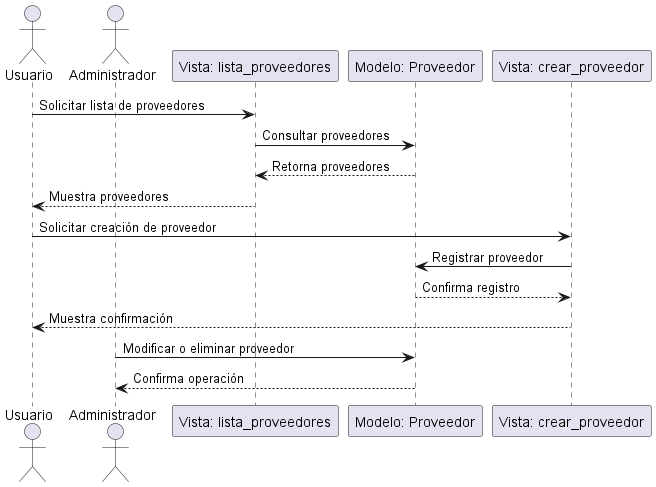
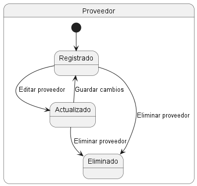
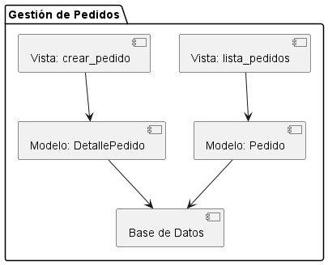

# ModeloERP

ModeloERP es un sistema de gestión empresarial desarrollado en Django. Este proyecto incluye módulos para la gestión de usuarios, inventario, finanzas, proveedores y reportes, proporcionando una solución integral para la administración de una empresa.

## Tabla de Contenidos

- [Descripción General](#descripción-general)
- [Características](#características)
- [Instalación](#instalación)
- [Modelos](#modelos)
  - [Usuarios](#usuarios)
  - [Inventario](#inventario)
  - [Gestión Financiera](#gestión-financiera)
  - [Proveedores](#proveedores)
  - [Pedidos](#pedidos)
  - [Reportes](#reportes)
- [Diagramas](#diagramas)
  - [Diagramas de Clases](#diagrama-de-clases)
  - [Diagrama Entidad-Relación](#diagrama-entidad-relación)
- [Descripción Técnica del Proyecto](#descripción-técnica-del-proyecto)
- [Manual de usuario](Manual_de_usuario.md)
- [Contribuciones](#contribuciones)
- [Licencia](#licencia)

---

## Descripción General

ModeloERP es un sistema modular que permite gestionar diferentes aspectos de una empresa, como usuarios, inventario, finanzas, proveedores y reportes. Está diseñado para ser flexible y escalable, permitiendo su personalización según las necesidades del negocio.

---

## Características

- **Gestión de Usuarios**: Control de usuarios con roles personalizados (`administrador`, `empleado`, `cliente`).
- **Inventario**: Gestión de productos y movimientos de inventario (entradas y salidas).
- **Gestión Financiera**: Registro de ingresos y gastos, generación de informes financieros.
- **Proveedores**: Administración de proveedores y sus productos asociados.
- **Pedidos**: Gestión de pedidos realizados por los clientes.
- **Reportes**: Generación de reportes dinámicos para finanzas, inventario, pedidos y proveedores.

---

## Instalación

1. Clona el repositorio:
   ```bash
   git clone https://github.com/diegoale23/modeloerp.git
   ```
2. Instala las dependencias:
   ```bash
   pip install -r requirements.txt
   ```
3. Realiza las migraciones:
   ```bash
   python manage.py makemigrations
   python manage.py migrate
   ```
4. Inicia el servidor:
   ```bash
   python manage.py runserver
   ```

---

## Modelos

### Usuarios

El modelo `Usuario` extiende el modelo `AbstractUser` de Django y permite gestionar usuarios con roles personalizados como `administrador`, `empleado` y `cliente`.

### Inventario

- **Producto**: Representa los productos en el inventario, con atributos como nombre, descripción, precio y stock.
- **MovimientoInventario**: Registra entradas y salidas de productos en el inventario.

### Gestión Financiera

- **RegistroFinanciero**: Registra ingresos y gastos asociados a usuarios.
- **InformeFinanciero**: Genera informes financieros basados en un rango de fechas.

### Proveedores

El modelo `Proveedor` permite gestionar proveedores y sus productos asociados mediante una relación de muchos a muchos.

### Pedidos
El modelo Pedido permite gestionar los pedidos realizados por los clientes. Incluye información como el cliente, los productos solicitados, la cantidad y el total del pedido.

### Reportes

El modelo `Reporte` permite generar reportes financieros, de inventario, pedidos y proveedores. Los reportes se generan dinámicamente según los parámetros proporcionados.

---

## Diagramas

### Diagrama de Clases


### Diagrama Entidad-Relación


### Usuarios

- Casos de Uso
  


- Diagramas de Objetos
  


- Diagramas de Secuencia


  
- Diagramas de Colaboración


- Diagramas de Estados


- Diagramas de Componentes


- Diagramas de Despliegue


### Inventario

- Casos de Uso
  


- Diagramas de Objetos
  


- Diagramas de Secuencia


  
- Diagramas de Colaboración


- Diagramas de Estados


- Diagramas de Componentes


- Diagramas de Despliegue


  
### Gestión Financiera

- Casos de Uso
  


- Diagramas de Objetos
  


- Diagramas de Secuencia


  
- Diagramas de Colaboración


- Diagramas de Estados


- Diagramas de Componentes


- Diagramas de Despliegue


  
### Proveedores

- Casos de Uso
  


- Diagramas de Objetos
  


- Diagramas de Secuencia


  
- Diagramas de Colaboración


- Diagramas de Estados



- Diagramas de Componentes


- Diagramas de Despliegue


  
### Pedidos

- Casos de Uso
  


- Diagramas de Objetos
  


- Diagramas de Secuencia


  
- Diagramas de Colaboración


- Diagramas de Estados


- Diagramas de Componentes



- Diagramas de Despliegue


### Reportes

- Casos de Uso
  


- Diagramas de Secuencia
  

  
- Diagramas de Colaboración


- Diagramas de Estados


- Diagramas de Componentes


- Diagramas de Despliegue


---

## Descripción Técnica del Proyecto

ModeloERP es un sistema de gestión empresarial desarrollado utilizando las siguientes tecnologías y herramientas:

- **Framework Backend**: El proyecto está construido con **Django**, un framework web de alto nivel en Python que facilita el desarrollo rápido y limpio de aplicaciones web.
- **Base de Datos**: Se utiliza **PostgreSQL** como sistema de gestión de bases de datos relacional, conocido por su robustez, escalabilidad y soporte para consultas avanzadas.
- **Frontend**: Las interfaces de usuario están diseñadas utilizando las plantillas de Django, con soporte para HTML, CSS y JavaScript para una experiencia de usuario interactiva.
- **Autenticación**: Django proporciona un sistema de autenticación integrado que se ha personalizado para gestionar roles como `administrador`, `empleado` y `cliente`.
- **Gestión de Dependencias**: Las dependencias del proyecto se manejan con **pip** y están listadas en el archivo `requirements.txt`.
- **Servidor de Desarrollo**: Durante el desarrollo, se utiliza el servidor integrado de Django. Para producción, se recomienda usar servidores como **Gunicorn** o **uWSGI** junto con **Nginx**.

### Arquitectura del Proyecto

El proyecto sigue una arquitectura modular, donde cada funcionalidad principal está organizada en aplicaciones independientes dentro del proyecto Django. Estas aplicaciones incluyen:

- **Usuarios**: Gestión de usuarios y roles.
- **Inventario**: Gestión de productos y movimientos de inventario.
- **Gestión Financiera**: Registro de ingresos y gastos, generación de informes financieros.
- **Proveedores**: Administración de proveedores y sus productos.
- **Pedidos**: Gestión de pedidos realizados por los clientes.
- **Reportes**: Generación de reportes dinámicos para diferentes áreas del sistema.

### Base de Datos

La base de datos utilizada es **PostgreSQL**, que ofrece las siguientes ventajas:
- Soporte para transacciones ACID.
- Consultas avanzadas y soporte para JSON.
- Escalabilidad para manejar grandes volúmenes de datos.
- Integración nativa con Django a través de su ORM (Object-Relational Mapping).

---
## Contribuciones

¡Las contribuciones son bienvenidas! Por favor, abre un issue o envía un pull request para sugerir mejoras o reportar errores.

---

## Licencia

Este proyecto está licenciado bajo la [MIT License](LICENSE).

